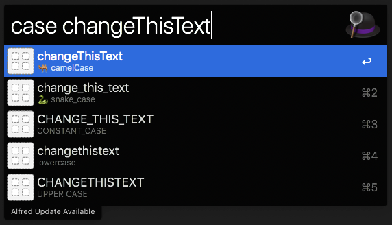

# Alfred-Case

Alfred workflow to convert some text into a different case format. 



## Install

```
$ npm install --global alfred-case
```

*Requires [Node.js](https://nodejs.org) 8+ and the Alfred [Powerpack](https://www.alfredapp.com/powerpack/).*

*Note: If you are using nvm on your machine, you may get a message when trying to use this workflow "couldn't find binary node". I fixed this issue by adding `ln -s $(command -v node) /usr/local/bin/node` to my `.bashrc` file which will create a symlink from the NVM node version.*

## Usage

In Alfred, type `case`, space, then enter in the text that you would like converted into a different case. After a second, you will see a list of your entered text converted into another case. 

Hit <kbd>Enter</kbd> to copy the converted text to the clipboard.

## Credits 

* [alfy](https://github.com/sindresorhus/alfy) - Made it pretty easy to crete a workflow!

## License

MIT. [See license](LICENSE.md).
